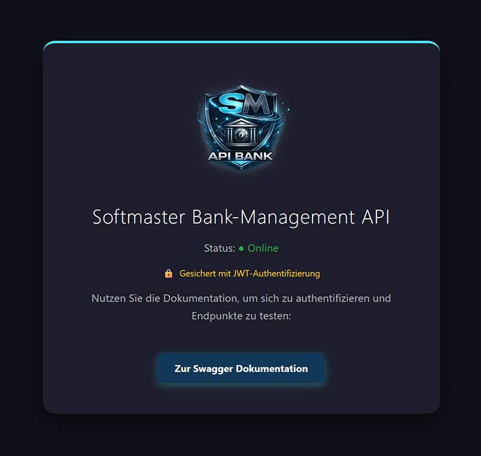

# 🏦 Bank-Management API 

A modular banking system built with Python, demonstrating advanced **Software Architecture**, automated testing, and a modern REST API.


---

## 🌐 Live Demo & Cloud Deployment
This API is containerized and deployed in the cloud via **Render.com** and also available on Azure for testing using a robust CI/CD pipeline.


| Environment        | URL |
|-------------------|-----|
| **Production (Custom Domain)** | [Softmater Bank API (softmaster.at)](https://bank-api.softmaster.at/) |
| **Interactive API Docs:**   | [Swagger UI (softmaster.at)](https://bank-api.softmaster.at//docs)
| **Render Preview / Backup**   | [Softmater Bank API (Render)](https://bank-management-api-53gb.onrender.com) |
| **Azure Demo**      | [Softmater Bank API (Azure)](https://nodrex-management-api-ddhqgfgtg6b4c7hm.westeurope-01.azurewebsites.net) |
| **Deployment Status** | [](https://github.com/SoftmasterAT/bank-management-api/actions/workflows/main.yml)

---

## 📝 API Overview

- **Main API Base URL:** `https://bank-api.softmaster.at/bank/`  
- **Swagger UI (Interactive Docs):** `https://bank-api.softmaster.at/docs`  


## Screenshot


### 🛠️ Tech Stack (DevOps & Cloud)
- **Cloud Provider:** Microsoft Azure (App Services)
- **Containerization:** Docker & GitHub Container Registry (GHCR)
- **CI/CD:** GitHub Actions (Automated Testing, Docker Build & Push)
- **Web Framework:** FastAPI (Asynchronous REST API)

## 🌟 Key Features
- **Advanced Architecture:** Implements the **Repository Pattern** with a decoupled `StorageInterface`, allowing seamless switching between JSON and SQL databases.
- **Persistence Layer:** Structured data handling with **JSON Storage** (and upcoming SQLite/SQLAlchemy support).
- **Smart Validation:** Integrated duplicate name check with **automated name suggestions** (randomized suffixes) to ensure data integrity.
- **OOP Core:** Deep use of inheritance, encapsulation, and Python Decorators (`@property`/`@setter`).
- **Modern UI:** Custom HTML Landing Page with **Dark Mode** support and automated Swagger documentation.
- **Quality Assurance:** Comprehensive test coverage for business logic and API endpoints via `unittest`.
- **Hybrid Storage Engine**: Seamlessly switch between **JSON** and **SQLite** using a dynamic `StorageFactory`.
- **Relational Persistence**: Full SQL support with optimized `UPDATE` operations and `UNIQUE` constraints.
- **Environment-Driven Configuration**: Manage storage types, file paths, and security keys via `.env` and Azure App Settings.
- **Interactive CLI**: Choose your preferred storage mode directly at startup.


## 🛠️ Tech Stack
- **Backend:** Python 3.12 + FastAPI
- **Storage:** JSON / SQLite (SQLAlchemy ready)
- **Containerization:** Docker
- **CI/CD:** GitHub Actions
- **Cloud:** Render.com & Azure App Services
- **Testing:** unittest & automated API integration


## 🚀 Quick Start

### 1. Clone repository
```bash
git clone https://github.com/SoftmasterAT/bank-management-api.git
cd bank-management-api
```
### 2. Install dependencies
```bash
pip install -r requirements.txt
```

### 3. Run API locally
```bash
uvicorn api:app --reload
```
### Access locally:

- **API Root:** http://localhost:8000/

- **Swagger Docs:** http://localhost:8000/docs

### 4. Run CLI (Interactive Mode)
```bash
python main.py
```


## 🧪 Testing

### Run all tests (Logic & API) from the root directory:
```bash
python -m unittest discover -s tests
```
The system is built for stability. Every commit is verified via GitHub Actions.
The project follows a modular structure where business logic and test suites are strictly separated. Automated tests ensure the reliability of both account logic and API endpoints.

**Prerequisites:**
- **API testing requires** `httpx` (included in `requirements.txt`).
- **Note:** The database (`konten.json`) is automatically initialized with default data if it is missing during the test run.

---

## 🐳 Docker Deployment
Build and run the containerized application locally:
```bash
docker build -t bank-api .
docker run -p 8000:8000 bank-api
```

## 📚 Documentation
Technical documentation is auto-generated from docstrings using **pdoc**.

**To generate documentation for a specific file:**
```bash
pdoc ./[filename].py -o ./dokumentation
```
**To generate the latest documentation (Windows):**
Simply run the provided batch script:
```bash
generate_docs.bat
```
The output will be generated in the ./dokumentation folder.

---

## 📂 Project Structure

```text
Bank-Management-API/
├── .github/workflows/          # CI/CD Automatisierung
│   ├── main.yml                # Haupt-Workflow für Deployment/Integration
│   └── python-app.yml          # Build- und Test-Automatisierung für Python
├── static/                     # Statische Medien-Dateien
│   ├── favicon.ico             # Icon für Web-Browser
│   ├── nr_logo.jpg             # Branding Logo (JPG)
│   ├── nr_logo.png             # Branding Logo (PNG)
│   └── nr_logo.webp            # Optimiertes Web-Bildformat
├── tests/                      # Test-Suite für Qualitätssicherung
│   ├── __init__.py             # Markiert Verzeichnis als Python-Modul
│   ├── test_api.py             # Integrationstests für die REST-Endpunkte
│   ├── test_banken.py          # Unit-Tests für die Bank-Logik
│   └── test_konto.py           # Unit-Tests für Kontofunktionen
├── .dockerignore               # Schließt lokale Dateien vom Docker-Build aus
├── .env.example                # Vorlage für Umgebungsvariablen (Security!)
├── .gitignore                  # Verhindert Upload von Unrat (z.B. __pycache__, .db)
├── api.py                      # FastAPI-Routing und API-Logik
├── auth_handler.py             # Sicherheit: JWT Token Handling & Verschlüsselung
├── Dockerfile                  # Bauanleitung für das Docker-Image
├── generate_docs.bat           # Skript zur automatischen Generierung der Dokumentation
├── girokonto.py                # Kontoklasse für Girokonten (Vererbung)
├── json_storage.py             # Speicher-Provider für JSON-Dateien
├── konto.py                    # Abstrakte oder Basis-Kontoklasse
├── logger_config.py            # Zentrale Konfiguration für das System-Logging
├── main.py                     # Startpunkt der Applikation (CLI & Controller)
├── PRODUKTION_CHECKLIST.md     # Sicherheitsvorgaben für den Live-Betrieb
├── README.md                   # Hauptdokumentation des Projekts
├── requirements.txt            # Python-Paketabhängigkeiten
├── sparkonto.py                # Kontoklasse für Sparkonten (Vererbung)
├── sqlite_storage.py           # Speicher-Provider für SQL-Datenbanken
├── storage_factory.py          # Erzeugt dynamisch den gewählten Speichertyp
└── storage_interface.py        # Definiert Standards für alle Speicherarten (Interface)

```

## 📊 Logging & Monitoring
The application implements a professional logging and monitoring strategy to ensure system stability and performance:
- **Centralized Logging**: All critical operations, data persistence events, and errors are recorded in `logs/bank_api.log` and streamed to `stdout` for Docker/Azure compatibility.
- **Performance Middleware**: A custom FastAPI middleware automatically measures and logs the response time (latency) for every incoming request.
- **Production Readiness**: Structured logs allow for advanced error tracking and auditing in cloud environments like Azure App Service or Container Apps.

## 🔐 Security & Authentication
The API implements a robust security layer based on Industry Standards:
- **JWT Authentication**: Secure stateless authentication using JSON Web Tokens (HS256).
- **RBAC (Role-Based Access Control)**: Different permission levels for `admin` (full access) and `DEMO_USER` (restricted transactions).
- **Password Hashing**: Industry-standard encryption using `bcrypt` to protect user credentials.
- **Environment Safety**: Sensitive data (Secret Keys, Hashes) are managed via Environment Variables and `.env` files, ensuring no secrets are leaked to the repository.
---
*Developed as a showcase for Python Backend Development, OOP
